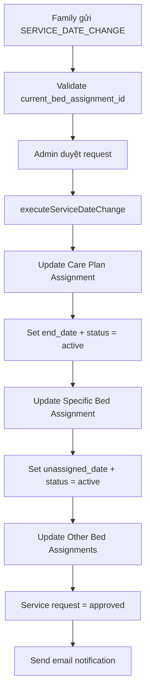

# Service Date Change - Current Bed Assignment Update

## 📋 Tổng quan
Cập nhật service request type `SERVICE_DATE_CHANGE` để bao gồm trường `current_bed_assignment_id`, cho phép xác định chính xác bed assignment cần gia hạn và reactivate nếu cần thiết.

## 🔄 Các thay đổi chính

### 1. **Schema Updates**
```typescript
// service-request.schema.ts
@Prop({ type: Types.ObjectId, ref: 'BedAssignment', default: null })
current_bed_assignment_id?: Types.ObjectId | null;
```

### 2. **DTO Updates**
```typescript
// create-service-request.dto.ts
@ApiPropertyOptional({ 
  description: 'Current bed assignment ID to extend (required for service date change)',
  example: '507f1f77bcf86cd799439016'
})
@ValidateIf((o) => o.request_type === 'service_date_change')
@IsMongoId()
current_bed_assignment_id?: string;

// service-date-change-request.dto.ts
@ApiProperty({ 
  description: 'Current bed assignment ID to extend',
  example: '507f1f77bcf86cd799439016'
})
@IsMongoId()
current_bed_assignment_id: string;
```

### 3. **Service Logic Updates**

#### **Validation:**
```typescript
// Validate required fields for SERVICE_DATE_CHANGE
if (dto.request_type === ServiceRequestType.SERVICE_DATE_CHANGE) {
  if (!dto.current_care_plan_assignment_id) {
    throw new BadRequestException('Thiếu current_care_plan_assignment_id');
  }
  if (!dto.current_bed_assignment_id) {
    throw new BadRequestException('Thiếu current_bed_assignment_id');
  }
  if (!dto.new_end_date) {
    throw new BadRequestException('Thiếu new_end_date');
  }
}
```

#### **Creation:**
```typescript
private async createServiceDateChangeRequest(dto: CreateServiceRequestDto, familyMemberId: string): Promise<ServiceRequest> {
  const payload = {
    // ... other fields
    current_care_plan_assignment_id: new Types.ObjectId(dto.current_care_plan_assignment_id!),
    current_bed_assignment_id: new Types.ObjectId(dto.current_bed_assignment_id!),
    new_end_date: new Date(dto.new_end_date!),
  };
  return new this.serviceRequestModel(payload).save();
}
```

#### **Execution Logic:**
```typescript
private async executeServiceDateChange(request: ServiceRequest): Promise<void> {
  const bedAssignmentId = this.toObjectId(request.current_bed_assignment_id);
  const newEndDate = request.new_end_date;

  // 1. Update care plan assignment (reactivate + extend)
  await this.carePlanAssignmentModel.findByIdAndUpdate(
    carePlanAssignmentId,
    { 
      end_date: newEndDate,
      status: 'active', // Reactivate if needed
      updated_at: new Date()
    }
  );

  // 2. Update specific bed assignment (reactivate + extend)
  await this.bedAssignmentModel.findByIdAndUpdate(
    bedAssignmentId,
    { 
      unassigned_date: newEndDate,
      status: 'active', // Reactivate if needed
      updated_at: new Date()
    }
  );

  // 3. Update other active bed assignments (fallback)
  await this.bedAssignmentModel.updateMany(
    { 
      resident_id: residentId,
      status: 'active',
      _id: { $ne: bedAssignmentId }
    },
    { 
      unassigned_date: newEndDate,
      updated_at: new Date()
    }
  );
}
```

### 4. **Populate Updates**
```typescript
.populate({
  path: 'current_bed_assignment_id',
  select: 'bed_id assigned_date unassigned_date status',
  populate: {
    path: 'bed_id',
    select: 'bed_number bed_type room_id',
    populate: {
      path: 'room_id',
      select: 'room_number floor room_type gender capacity'
    }
  }
})
```

### 5. **Swagger Examples Update**
```typescript
service_date_change: {
  summary: '📅 Gia hạn dịch vụ (SERVICE_DATE_CHANGE)',
  description: 'Gia hạn thời gian sử dụng dịch vụ cho care plan assignment và bed assignment hiện tại',
  value: {
    resident_id: '507f1f77bcf86cd799439011',
    family_member_id: '507f1f77bcf86cd799439012',
    request_type: 'service_date_change',
    current_care_plan_assignment_id: '507f1f77bcf86cd799439015',
    current_bed_assignment_id: '507f1f77bcf86cd799439016', // ✅ NEW FIELD
    new_end_date: '2024-12-31T23:59:59.000Z',
    emergencyContactName: 'Nguyễn Văn A',
    emergencyContactPhone: '0901234567',
    medicalNote: 'Cư dân cần chăm sóc đặc biệt do bệnh tim'
  }
}
```

## ✨ Tính năng mới

### **1. Bed Assignment Reactivation**
- ✅ **Xác định chính xác**: Sử dụng `current_bed_assignment_id` thay vì tìm theo `resident_id`
- ✅ **Auto Reactivation**: Tự động chuyển bed assignment về `active` nếu đang không active
- ✅ **Grace Period Support**: Hỗ trợ gia hạn trong vòng 5 ngày sau hết hạn
- ✅ **Status Consistency**: Đảm bảo bed assignment và care plan cùng trạng thái `active`

### **2. Enhanced Validation**
- ✅ **Required Field**: `current_bed_assignment_id` bắt buộc cho SERVICE_DATE_CHANGE
- ✅ **Type Safety**: Validation với `@IsMongoId()` decorator
- ✅ **Clear Error Messages**: Thông báo lỗi rõ ràng khi thiếu field

### **3. Detailed Population**
- ✅ **Full Bed Info**: Populate bed assignment với thông tin bed và room
- ✅ **Room Details**: Bao gồm room number, floor, type, gender, capacity
- ✅ **Status Tracking**: Hiển thị status, assigned_date, unassigned_date

## 🔧 Nghiệp vụ hỗ trợ

### **Trường hợp sử dụng:**

1. **Bed Assignment hết hạn và chuyển sang trạng thái khác:**
   - ✅ Khi admin duyệt gia hạn → Tự động chuyển về `active`
   - ✅ Cập nhật `unassigned_date` với thời hạn mới
   - ✅ Resident có thể tiếp tục ở phòng

2. **Bed Assignment vẫn đang active:**
   - ✅ Cập nhật `unassigned_date` mới
   - ✅ Giữ nguyên trạng thái `active`

3. **Multiple Bed Assignments:**
   - ✅ Xử lý chính xác bed assignment được chỉ định
   - ✅ Cập nhật các bed assignment khác của resident (fallback)

## 📊 Luồng xử lý mới



## 💡 Lợi ích

1. **Chính xác hơn**: Xác định đúng bed assignment cần gia hạn
2. **Tự động hóa**: Auto reactivation cho cả care plan và bed assignment
3. **Linh hoạt**: Hỗ trợ grace period 5 ngày
4. **Đồng bộ**: Đảm bảo tính nhất quán dữ liệu
5. **Trải nghiệm tốt**: Resident không bị gián đoạn dịch vụ

## 🚀 API Usage

### **Tạo Service Date Change Request:**
```javascript
POST /service-requests/service-date-change
{
  "resident_id": "507f1f77bcf86cd799439011",
  "family_member_id": "507f1f77bcf86cd799439012",
  "current_care_plan_assignment_id": "507f1f77bcf86cd799439015",
  "current_bed_assignment_id": "507f1f77bcf86cd799439016", // ✅ Required
  "new_end_date": "2024-12-31T23:59:59.000Z",
  "emergencyContactName": "Nguyễn Văn A",
  "emergencyContactPhone": "0901234567",
  "medicalNote": "Gia hạn dịch vụ thêm 3 tháng"
}
```

### **Response với Populate:**
```javascript
{
  "_id": "...",
  "request_type": "service_date_change",
  "status": "pending",
  "current_care_plan_assignment_id": {
    "care_plan_ids": [...],
    "total_monthly_cost": 5000000,
    "end_date": "2024-09-30T23:59:59.000Z",
    "status": "active"
  },
  "current_bed_assignment_id": { // ✅ New populated field
    "bed_id": {
      "bed_number": "B001",
      "bed_type": "single",
      "room_id": {
        "room_number": "101",
        "floor": 1,
        "room_type": "2_bed",
        "gender": "male",
        "capacity": 2
      }
    },
    "assigned_date": "2024-06-01T00:00:00.000Z",
    "unassigned_date": "2024-09-30T23:59:59.000Z",
    "status": "active"
  },
  "new_end_date": "2024-12-31T23:59:59.000Z"
}
```

## ⚠️ Breaking Changes

- **Required Field**: `current_bed_assignment_id` bây giờ là bắt buộc cho SERVICE_DATE_CHANGE
- **Frontend Update**: Cần cập nhật frontend để gửi field mới
- **API Contract**: Swagger documentation đã được cập nhật

Với cập nhật này, hệ thống sẽ xử lý gia hạn dịch vụ chính xác và toàn diện hơn! 🎯
