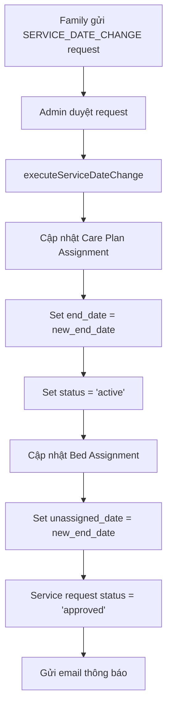

# Service Date Change Logic Update

## 📋 Tổng quan
Cập nhật logic xử lý service request type `SERVICE_DATE_CHANGE` để hỗ trợ gia hạn dịch vụ một cách toàn diện, bao gồm cả care plan assignment và bed assignment.

## 🔄 Các thay đổi chính

### **Trước khi cập nhật:**
```javascript
private async executeServiceDateChange(request: ServiceRequest): Promise<void> {
  // Chỉ cập nhật end_date của care plan assignment
  await this.carePlanAssignmentModel.findByIdAndUpdate(
    carePlanAssignmentId,
    { 
      end_date: newEndDate,
      updated_at: new Date()
    }
  );
}
```

### **Sau khi cập nhật:**
```javascript
private async executeServiceDateChange(request: ServiceRequest): Promise<void> {
  // 1. Cập nhật care plan assignment với end_date mới và reactivate
  await this.carePlanAssignmentModel.findByIdAndUpdate(
    carePlanAssignmentId,
    { 
      end_date: newEndDate,
      status: 'active', // Reactivate để hỗ trợ gia hạn trong 5 ngày
      updated_at: new Date()
    }
  );

  // 2. Cập nhật unassigned_date của bed assignment hiện tại
  await this.bedAssignmentModel.updateMany(
    { 
      resident_id: residentId,
      status: 'active'
    },
    { 
      unassigned_date: newEndDate,
      updated_at: new Date()
    }
  );
}
```

## ✨ Tính năng mới

### 1. **Cập nhật Bed Assignment**
- ✅ Khi gia hạn care plan, bed assignment cũng được cập nhật `unassigned_date`
- ✅ Đảm bảo tính nhất quán giữa care plan và bed assignment
- ✅ Resident có thể ở lại phòng đến hết thời hạn mới

### 2. **Reactivation Logic**
- ✅ Tự động chuyển care plan assignment về `active` khi gia hạn
- ✅ Hỗ trợ nghiệp vụ gia hạn trong vòng 5 ngày sau hết hạn
- ✅ Cho phép resident tiếp tục sử dụng dịch vụ mà không bị gián đoạn

### 3. **Đồng bộ dữ liệu**
- ✅ Care plan assignment và bed assignment có cùng `end_date`/`unassigned_date`
- ✅ Tránh tình trạng mâu thuẫn dữ liệu
- ✅ Dễ dàng tracking và quản lý

## 🔧 Nghiệp vụ hỗ trợ

### **Gia hạn trong 5 ngày:**
1. **Trường hợp 1**: Care plan assignment đã hết hạn và chuyển sang trạng thái khác
   - ✅ Khi admin duyệt gia hạn → Tự động chuyển về `active`
   - ✅ Resident có thể tiếp tục sử dụng dịch vụ

2. **Trường hợp 2**: Care plan assignment vẫn đang `active`
   - ✅ Cập nhật `end_date` mới
   - ✅ Giữ nguyên trạng thái `active`

3. **Trường hợp 3**: Bed assignment cần đồng bộ
   - ✅ Cập nhật `unassigned_date` theo `end_date` mới
   - ✅ Resident không bị mất phòng khi gia hạn

## 📊 Luồng xử lý



## 💡 Lợi ích

1. **Tính nhất quán**: Care plan và bed assignment luôn đồng bộ
2. **Linh hoạt**: Hỗ trợ gia hạn trong grace period 5 ngày
3. **Tự động hóa**: Không cần can thiệp thủ công để reactivate
4. **Trải nghiệm tốt**: Resident không bị gián đoạn dịch vụ

## ⚠️ Lưu ý quan trọng

- **Grace Period**: Hệ thống cho phép gia hạn trong vòng 5 ngày sau hết hạn
- **Auto Reactivation**: Care plan assignment tự động chuyển về `active` khi gia hạn
- **Data Consistency**: Luôn đảm bảo `end_date` và `unassigned_date` khớp nhau
- **Multiple Beds**: Nếu resident có nhiều bed assignment, tất cả đều được cập nhật

## 🚀 Cách sử dụng

### **Frontend Flow:**
1. Family tạo service request với `request_type: 'service_date_change'`
2. Cung cấp `current_care_plan_assignment_id` và `new_end_date`
3. Admin duyệt request
4. Hệ thống tự động cập nhật cả care plan và bed assignment
5. Family nhận email thông báo gia hạn thành công

### **API Example:**
```javascript
// Tạo request gia hạn
POST /service-requests
{
  "resident_id": "507f1f77bcf86cd799439011",
  "request_type": "service_date_change",
  "current_care_plan_assignment_id": "507f1f77bcf86cd799439015",
  "new_end_date": "2024-12-31T23:59:59.000Z"
}

// Admin duyệt
PATCH /service-requests/:id/approve
```

Với cập nhật này, hệ thống sẽ xử lý gia hạn dịch vụ một cách toàn diện và tự động! 🎯
